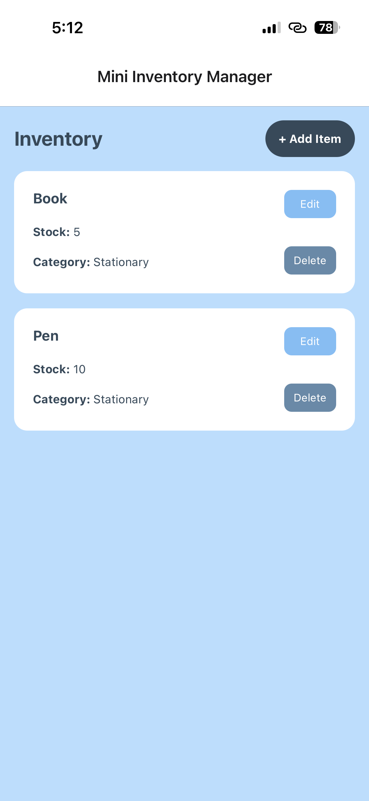
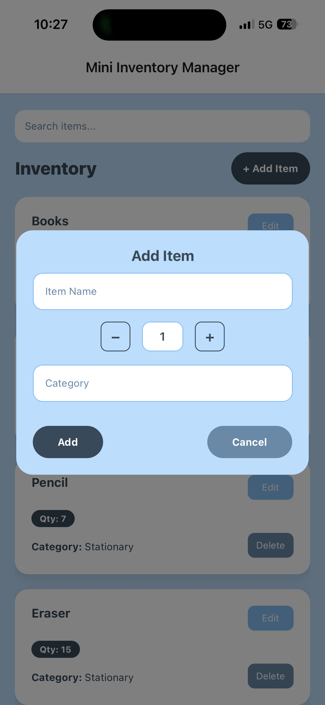
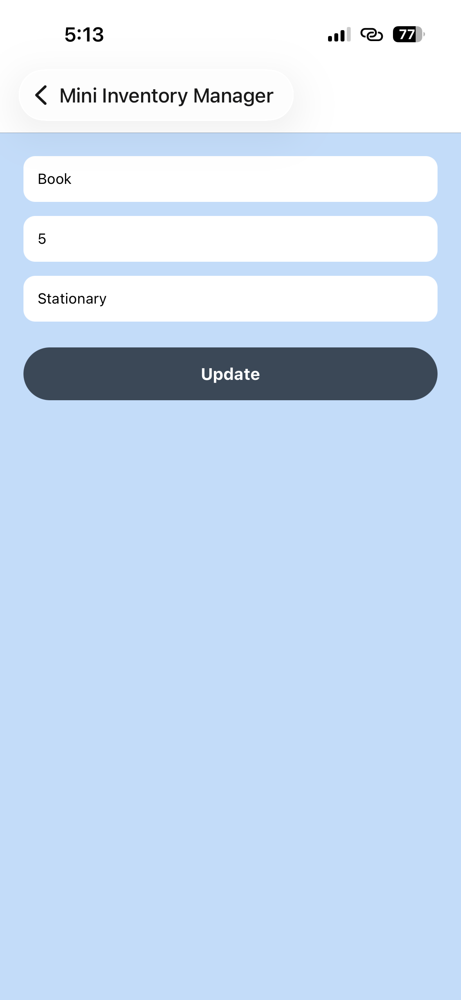

# Mini Inventory Manager 📦

## 📱 App Overview
Mini Inventory Manager is a simple and user-friendly mobile application developed using **React Native with Expo**.  
The application allows users to manage inventory items by viewing, adding, editing, and deleting items.  
All inventory data is stored locally using **AsyncStorage**, ensuring data persistence even after the app is closed or restarted.

This project was developed as part of a **Mobile Application Developer Internship Assignment**.

---

## ⚙️ Installation Steps

### 1. Clone the repository

```bash
git clone https://github.com/Curious-Cathy/MiniInventoryManager
````

### 2. Navigate to the project directory

```bash
cd MiniInventoryManager
```

### 3. Install dependencies

```bash
npm install
```

### 4. Run the application

```bash
npm start
```

Scan the QR code displayed in the terminal using the **Expo Go** app to launch the application on your mobile device.

---

## 🖼️ Screenshots

### Home Screen



### Add Item Screen



### Edit Item Screen



---

## 🧠 Architecture Explanation

The application follows a clean and modular architecture to improve readability and maintainability.

### App.js

* Acts as the entry point of the application
* Manages navigation between screens using **React Navigation**

### screens/

Contains all the main UI screens:

* **HomeScreen.js**
  Displays the inventory list and provides options to add, edit, and delete items

* **AddItemScreen.js**
  Provides a form interface for adding new inventory items

* **EditItemScreen.js**
  Allows users to update existing inventory item details

### components/

Contains reusable UI components:

* **ItemCard.js**
  A reusable card component used to display individual inventory items

### services/

Contains business logic and utility functions:

* **storageService.js**
  Handles local data persistence using **AsyncStorage**

This structure ensures separation of concerns, reusable components, and clean code organization.

---

## 💾 Data Persistence

The application uses **AsyncStorage** to store inventory data locally.
This ensures that all items remain available even after the application is closed or restarted.

---

## 🚀 Future Enhancements

* Search and filter inventory items
* Sorting items by name or quantity
* Low stock indicators
* Improved form validation
* Local notifications

---

## 👤 Author

Developed by **Neha A R**

Email: arneha2004@gmail.com
GitHub: https://github.com/Curious-Cathy


